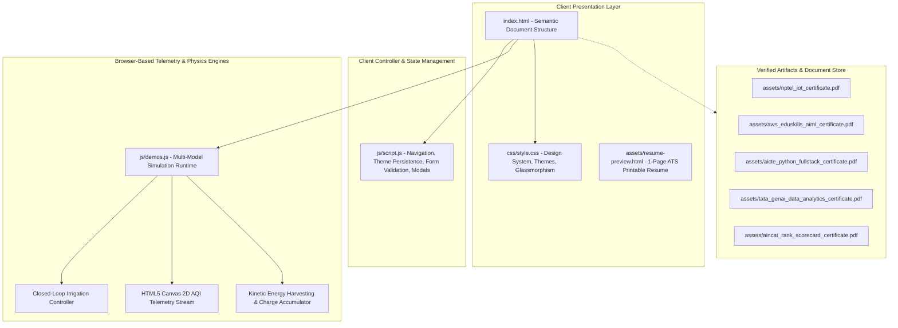
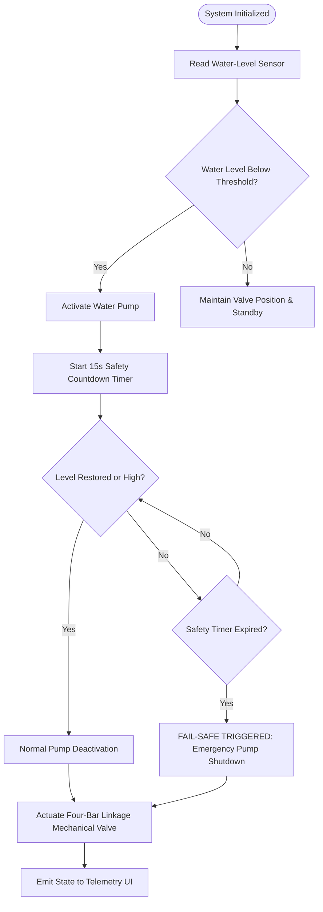
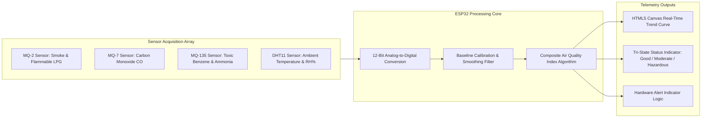
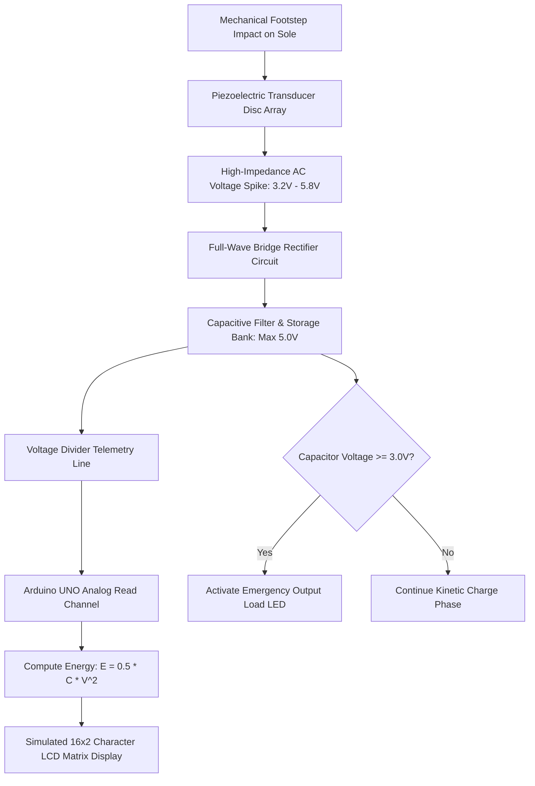

# Kothamasu Mohan Venkata Subba Rao | Software Engineering & IoT Portfolio

[](https://mohankothamasu.github.io/portfolio/)
[](https://github.com/MOHANKOTHAMASU/portfolio)
[](https://www.linkedin.com/in/mohan-venkata-subba-rao-kothamasu-4464b433a)
[](https://www.hackerrank.com/profile/kmvsubbarao28)
[](https://leetcode.com/problemset/)
[](LICENSE)

---

## 1. Executive Summary

This repository houses the source code, interactive telemetry engines, and technical documentation for the personal portfolio of **Kothamasu Mohan Venkata Subba Rao**.

- **Degree:** Bachelor of Technology in Information Technology (Expected Graduation: 2027)
- **Institution:** QIS College of Engineering and Technology, Ongole, Andhra Pradesh, India
- **Cumulative GPA:** 7.50 / 10.0
- **Target Engineering Domains:** Software Development, Python Backend Systems, Frontend Engineering, Embedded IoT Solutions

The web application is built entirely with vanilla web technologies (HTML5, CSS3 Custom Properties, and modular ES6+ JavaScript), delivering high-performance asset rendering, custom dark/light theme persistence, zero-dependency browser-based physics/hardware simulations, and direct view-only verified credential distribution.

---

## 2. High-Level Architecture

The architecture decouples UI styling, presentation state management, and real-time physical simulation mathematics into isolated vanilla JavaScript modules.



---

## 3. Technology Stack & Implementation Details

| Layer | Technologies Used | Architectural Function |
| :--- | :--- | :--- |
| **Markup & Semantics** | HTML5 (W3C Standard) | Semantic document tree, accessibility ARIA tags, OpenGraph metadata |
| **Styling & Theming** | CSS3 (Grid, Flexbox, Custom Properties) | Zero-runtime CSS variables, responsive design, dark/light mode toggle |
| **Client Scripting** | JavaScript (ES6+ Vanilla) | DOM manipulation, modal orchestration, client-side validation |
| **Data Visualization** | HTML5 Canvas 2D API | Custom real-time spline chart plotting without external chart dependencies |
| **Embedded & Hardware** | Embedded C/C++, Arduino Framework | Microcontroller logic for ESP32 and Arduino UNO prototype systems |
| **Database & Scripting**| Python 3.x, MySQL, SQL | Backend algorithm practice, relational queries, complex joins, data pipelines |
| **Hosting & CI/CD** | GitHub Pages, Git | Version-controlled static hosting with zero Jekyll overhead (.nojekyll) |

---

## 4. Deep-Dive Engineering Projects & System Flows

### Project 1: Sustainable Autonomous Irrigation System

An automated fluid regulation system engineered to eliminate water waste, prevent pump dry-running, and ensure uniform multi-zone distribution.



- **Mechanical Integration:** Four-bar linkage mechanism converting rotational motor input into precise linear valve displacement.
- **Fail-Safe Mechanism:** In the event of sensor disconnection or failure, a dual-layer countdown timer interrupts power to the pump motor within 15 seconds to prevent thermal stress and cavitation.

---

### Project 2: IoT Air Quality & Hazardous Gas Monitoring System

A multi-sensor environmental telemetry node designed for high-occupancy sensitive facilities such as hospitals, university classrooms, and chemical laboratories.



- **Telemetry Algorithm:** Computes weighted composite Air Quality Index (AQI) values based on calibrated parts-per-million (PPM) readings.
- **Dynamic Simulation:** Features interactive scenarios for Baseline Clean Air, Moderate Urban Smog, and Industrial Gas Hazard.

---

### Project 3: Piezoelectric Footwear Power Generation

A renewable kinetic energy harvester embedded into footwear insoles, capturing mechanical pressure exerted during walking and converting it into regulated DC electrical energy.



- **Mathematical Energy Accumulation:** Implements asymptotic charge retention modeling: $V_{cap}(t) = V_{max}(1 - e^{-t/RC})$.
- **Telemetry UI:** Simulates a 16x2 HD44780 LCD display rendering real-time step count, instantaneous voltage, and accumulated milliJoules (mJ).

---

## 5. Verified Credentials & Public Direct Artifacts

All certificates are statically hosted within the repository under [`assets/`](file:///c:/Users/kmvsu/cv%20or%20resume/assets/) and are directly accessible without third-party login or authentication walls.

| Credential Name | Issuing Organization | Verification Details | Direct Public Document |
| :--- | :--- | :--- | :--- |
| **Internet of Things (IoT)** | NPTEL / IIT | Score: 78% (Elite Category) | [nptel_iot_certificate.pdf](https://mohankothamasu.github.io/portfolio/assets/nptel_iot_certificate.pdf) |
| **AI-ML Virtual Internship** | AWS Academy / AICTE – EduSkills | 10-Week Virtual Internship • Grade A (Very Good) • ID: 7c8b584366da4feb9c2c95bc38b2a0f9 | [aws_eduskills_aiml_certificate.pdf](https://mohankothamasu.github.io/portfolio/assets/aws_eduskills_aiml_certificate.pdf) |
| **Python Full Stack Virtual Internship** | AICTE / Edunet Foundation | Full Stack Web & Python Engineering | [aicte_python_fullstack_certificate.pdf](https://mohankothamasu.github.io/portfolio/assets/aicte_python_fullstack_certificate.pdf) |
| **GenAI / Data Analytics Job Simulation** | Tata / Forage | Analytics & Engineering Workflows | [tata_genai_data_analytics_certificate.pdf](https://mohankothamasu.github.io/portfolio/assets/tata_genai_data_analytics_certificate.pdf) |
| **National Competitive Technical Assessment** | AINCAT | All-India Rank: 6000 | [aincat_rank_scorecard_certificate.pdf](https://mohankothamasu.github.io/portfolio/assets/aincat_rank_scorecard_certificate.pdf) |

---

## 6. Algorithmic Problem Solving & Technical Practice

Structured algorithmic practice is maintained across major coding platforms:

- **Core Focus:** Python (Primary algorithm logic, string operations, recursive workflows)
- **Database Systems:** SQL (Relational database management, joins, subqueries, grouping)
- **Object-Oriented Design:** Java (Encapsulation, inheritance, polymorphism, modularity)

| Platform | Profile URL | Focus Area |
| :--- | :--- | :--- |
| **HackerRank** | [hackerrank.com/profile/kmvsubbarao28](https://www.hackerrank.com/profile/kmvsubbarao28) | Python Problem Solving & SQL Query Challenges |
| **LeetCode** | [leetcode.com/problemset](https://leetcode.com/problemset/) | Data Structures & Algorithmic Patterns |
| **GitHub** | [github.com/MOHANKOTHAMASU](https://github.com/MOHANKOTHAMASU) | Source Code, Assignments & Experimental Systems |

---

## 7. Directory Structure

```
.
|-- .gitignore
|-- .nojekyll
|-- README.md
|-- index.html
|-- css/
|   `-- style.css
|-- js/
|   |-- demos.js
|   `-- script.js
`-- assets/
    |-- README.md
    |-- profile.jpg
    |-- resume-preview.html
    |-- nptel_iot_certificate.pdf
    |-- aws_eduskills_aiml_certificate.pdf
    |-- aicte_python_fullstack_certificate.pdf
    |-- tata_genai_data_analytics_certificate.pdf
    |-- aincat_rank_scorecard_certificate.pdf
    |-- airquality_prototype.jpg
    |-- airquality_architecture.jpg
    |-- irrigation_prototype.jpg
    |-- irrigation_architecture.jpg
    |-- piezo_footwear_prototype.jpg
    `-- piezo_architecture.jpg
```

---

## 8. Local Setup & Execution Guide

### Prerequisites
No compilation tools, package managers, or runtime frameworks are required. A modern web browser (Google Chrome, Mozilla Firefox, Microsoft Edge, or Safari) is sufficient.

### Step 1: Clone Repository
```bash
git clone https://github.com/MOHANKOTHAMASU/portfolio.git
cd portfolio
```

### Step 2: Launch Local Server

#### Option A: Python Built-in Server
```bash
python -m http.server 8000
```
Navigate to `http://localhost:8000` in your browser.

#### Option B: Node.js Static Server
```bash
npx serve .
```

#### Option C: VS Code Live Server Extension
Open the directory in VS Code, right-click `index.html`, and select **Open with Live Server**.

---

## 9. Contact & Professional Channels

- **Name:** Kothamasu Mohan Venkata Subba Rao
- **Email:** [kmvsubbarao28@gmail.com](mailto:kmvsubbarao28@gmail.com)
- **Phone:** [+91 9618009899](tel:+919618009899)
- **Location:** Addanki, Andhra Pradesh, India
- **LinkedIn:** [linkedin.com/in/mohan-venkata-subba-rao-kothamasu-4464b433a](https://www.linkedin.com/in/mohan-venkata-subba-rao-kothamasu-4464b433a)
- **GitHub:** [github.com/MOHANKOTHAMASU](https://github.com/MOHANKOTHAMASU)
- **Online ATS Resume:** [View 1-Page Resume Preview](https://mohankothamasu.github.io/portfolio/assets/resume-preview.html)
